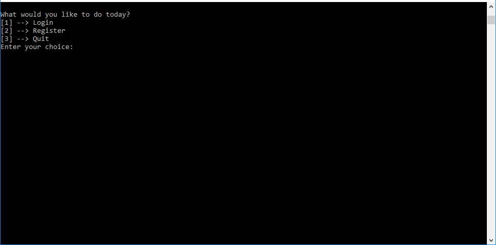
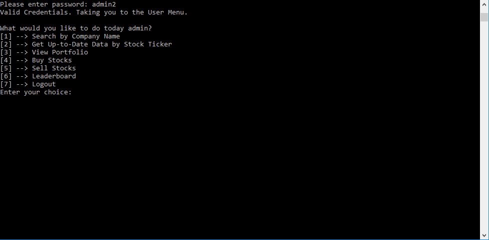
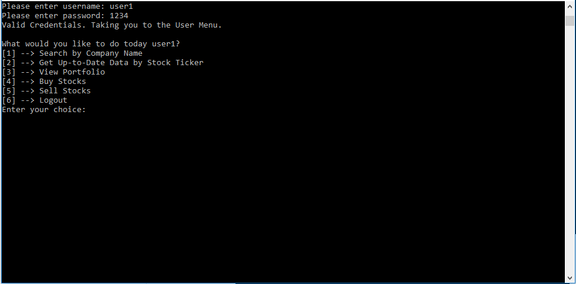

# Stock Terminal Application
## Description
This repository contains the files used to build a simple stock trader terminal application. The game starts users off with $1,000,000 (yes, we're very generous)
that they can use to buy and sell stocks based on the current market info we get from the [Markit API](http://dev.markitondemand.com/MODApis/Api/v2/doc).
There is an admin user that has the same functions as all the users but he/she can also see a leaderboard. 

The application was designed in the Model-View-Controller (MVC) format using the Requests and Pandas libraries in Python and an SQLite database.

## Files
Here's a list of files in the repository:
- `model.py`: Contains the functions that query the database and process information/data
- `view.py`: Contains the functions that display text on the terminal application
- `controller.py`: Contains the functions that control the logical flow of the application
- `create_database.py`: Contains the functions needed to create a simple SQLite database in the folder, 1 admin user and 5 regular users
- `wrapper.py`: Contains the functions used to make API calls

## Usage
In order to start using the terminal application, please follow these steps (you must have Python installed):
1) Clone the repository
```
git clone 
```
2) Create a database
```
python create_database.py
```
3) Run the app
```
python controller.py
```
4) Login Details
- **Admin Account**
  - **Username:** admin 
  - **Password:** admin2
- **User Accounts**
  - **Username:** user1/user2/user3/user4/user5
  - **Password:** 1234

> **Note: The leaderboard often spits out errors because it makes too many requests to the API.**

## Views
**Login View:**


**Admin View:**


**User View:**

